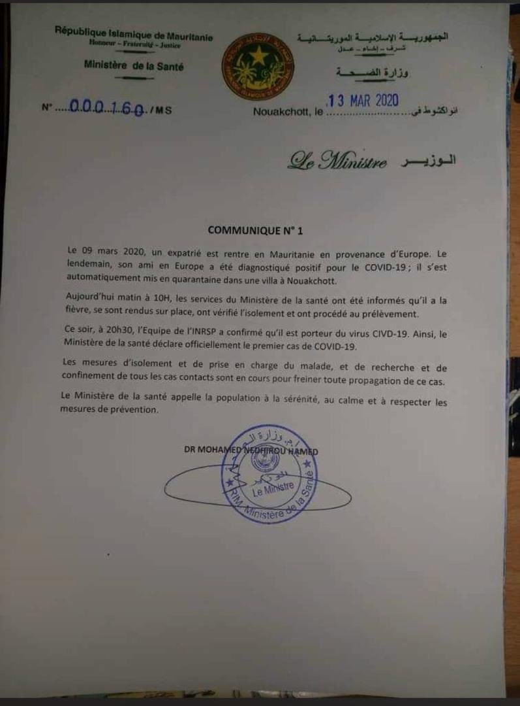

# Actualités gouvernementales

## 26-03-2020

### Communiqué du Ministère de la santé:

* Troisième cas COVID-19 détecté en Mauritanie

## 21-03-2020

### Communiqué du Ministère de l'intérieur:

* Fermeture du passage frontalier de Rosso

## 18-03-2020

### Communiqué du Ministère de la Santé:

* Deuxième cas COVID-19 détecté en Mauritanie

## 15-03-2020

### Communiqué du Ministère de la Culture

* Arrêt des activités culturelles à partir du lundi 16 mars 2020 minuit.

## 14-03-2020

### Communiqué du Ministère de l'Education Nationale

* Fermeture de l'ensemble des établissements scolaire dès le lundi 16 mars 2020.

## 13-03-2020

### Communiqué du Ministère de la Santé:

* Premier cas COVID-19 détecté en Mauritanie

