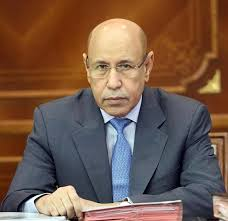

# Mot du Président

> « Citoyens, citoyennes
>
>  Notre pays traverse une période difficile au cours de laquelle il fait face, à l’instar des autres pays du monde, au coronavirus qui constitue désormais, au regard de tous les critères, un fléau mondial.
>
>  En ces moments de grave menace, apparait avec force la communauté de destin qui lie un même peuple. Le fléau frappe sans discrimination et la capacité d’y faire face est à la mesure du degré de prise de conscience et de l’aptitude de tous à conjuguer les efforts dans une dynamique d’unité nationale et de solidarité sociale.
>
>  Les graves conséquences que cette pandémie a entrainé dans des pays développés, en dépit de la performance de leurs systèmes de santé et de la qualité de leurs infrastructures sanitaires, notamment en termes de laboratoires modernes et d’hôpitaux de référence, sont la preuve éloquente que notre première bouée de sauvetage réside dans les actions qui permettent d’éviter la propagation du virus et l’élargissement du spectre de contamination.
>
>  Conscient de cela, nous avons, dès le début, pris une série de mesures sanitaires et sécuritaires préventives en vue de protéger le pays contre l’infiltration du virus et de réduire les pratiques qui contribuent à sa propagation par la limitation des rassemblements, l’auto-confinement et la restriction des déplacements que ne dicte pas l’extrême nécessité.
>
>  Je saisis cette occasion pour adresser mes chaleureuses salutations et mes vifs remerciements à tous les citoyens pour avoir fait montre de prise de conscience et de responsabilité et pour avoir réagi positivement à l’ensemble des mesures qui ont été prises.
>
>  J’adresse également mes salutations et mes remerciements au corps médical et aux forces armées et de sécurité pour des efforts gigantesques qu’ils fournissent pour assurer l’exécution maitrisée et efficace du plan national de lutte contre ce fléau.
>
>  C’est aussi le lieu pour moi d’exprimer mes remerciements aux pays frères et voisins pour la fluidité des modalités de coordination dans le contrôle des passages frontaliers communs.
>
>  Toutes les mesures prises à ces différents niveaux et celles qui viendraient à être décidées en cas de besoin sont dispositions indispensables à la protection de notre pays contre ce fléau.
>
>  A ce titre, je voudrai réaffirmer à tous que le combat contre la pandémie implique une mobilisation générale constante et une action continue pour impulser une synergie de toutes nos forces vives : administration publique, partis politiques, leaders d’opinion, opérateurs économiques, structures communautaires et l’ensemble des citoyens.
>
>  En conséquence, j’invite l’ensemble des citoyens à s’impliquer activement dans le combat que nous menons contre la pandémie du coronavirus qui constitue une réelle menace pour notre peuple et pour notre nation.
>
>  La situation exceptionnelle que nous vivons actuellement a entrainé une nouvelle complication de notre vie quotidienne et pourrait générer d’autres conséquences avec un plus grand impact en fonction de l’évolution de la situation au niveau intérieure et extérieur.
>
>  Parmi les conséquences éventuelles, figurent les perturbations de l’approvisionnement du marché national en raison du dérèglement des mouvements commerciaux internationaux ou de la difficulté des citoyens à générer les moyens suffisants pour garantir leurs divers besoins.
>
>  Pour faire face à la perturbation éventuelle des circuits commerciaux internationaux, nous avons instruit les départements ministériels concernés aux fins de prendre toutes les dispositions nécessaires pour assurer la continuité de l’approvisionnement du pays en produits alimentaires, en médicaments et en hydrocarbures.
>
>  S’agissant du renforcement de la capacité des citoyens à disposer de moyens leur permettant de répondre à leurs besoins divers, il a été décidé de créer un Fonds spécial de solidarité sociale et de lutte contre le coronavirus, dans le but de mobiliser toutes les ressources disponibles pour les orienter vers les activités sujettes aux conséquences éventuelles de la situation actuelle sur les citoyens, en particulier ceux parmi eux qui sont les plus vulnérables ou qui ont de faibles revenus.
>
>  Ce fonds sera ouvert à tous ceux qui souhaitent contribuer à cet effort national, notamment les acteurs économiques nationaux et partenaires internationaux.
>
>  L’Etat a consacré une contribution à ce fonds à hauteur de 25 milliards MRO destinés à financer les actions suivantes :
>
>  1. L’acquisition de quantités de médicaments, de matériels et d’équipement sanitaires qui répondent aux besoins du pays pour faire face à la pandémie.
>
>  2. L’allocation d’un montant de 5 milliards MRO à l’appui de 30 mille familles pauvres parmi celles dont les chefs de ménage sont des femmes, les personnes du troisième âge et les personnes vivant avec un handicap, et dont la majorité réside à Nouakchott. Ceux-ci recevront une aide financière mensuelle pendant trois mois.
>
>  3. La prise en charge par l’Etat, pour le reste de l’année, de l’ensemble des impôts et taxes douanières sur les importations de blé, d’huile, de lait en poudre, de légumes et de fruits.
>
>  4. La prise en charge par l’Etat, pendant deux mois, des factures d’eau et d’électricité des familles pauvres.
>
>  5. La prise en charge par l’Etat, pour le reste de l’année, des frais de consommation d’eau dans les villages.
>
>  6. La prise en charge par l’Etat, pendant deux mois, de toutes les taxes municipales liées aux activités informelles.
>
>  7. La prise en charge par l’Etat, pour le reste de l’année, de toutes les taxes appliquées aux chefs de ménages qui travaillent dans le secteur de la pêche artisanale.
>
>  Il convient de souligner que les ressources allouées à ce fonds n’impacteront pas les projets sociaux et de développement programmés cette année et dont le rythme d’exécution sera accéléré pour accompagner de façon efficace les impératifs de la situation actuelle.
>
>  Citoyens, citoyennes,
>
>  La gravité du danger qui nous menace et les sacrifices qu’exige la protection de la santé de nos citoyens, me conduisent à convier, de nouveau, l’ensemble de nos citoyens et des résidents étrangers dans notre pays à veiller au respect scrupuleux des mesures préventives, à rester chez eux pour autant que leur déplacement n’est pas indispensable, à limiter les voyages interurbains aux seules nécessités absolues et à prendre toutes les mesures de précaution et de vigilance.
>
>  Ce faisant, je suis certain que nous saurons, par la volonté d’Allah Le Tout Puissant, dépasser cette étape difficile et poursuivre notre marche sur la voie du progrès et de la prospérité.
>
>  Je vous remercie »





